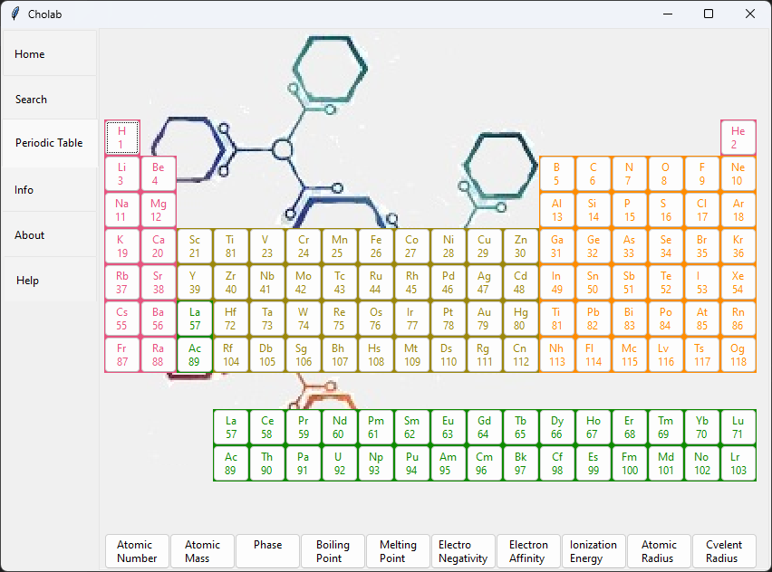

# Cholab

A desktop app for Chemical properties of elements

## Getting Started

clone this repository by:

```bash
git clone https://github.com/htmujahid/cholab-desktop
```

```bash
cd cholab-desktop
```

```bash
py main.py
```

## Demo




